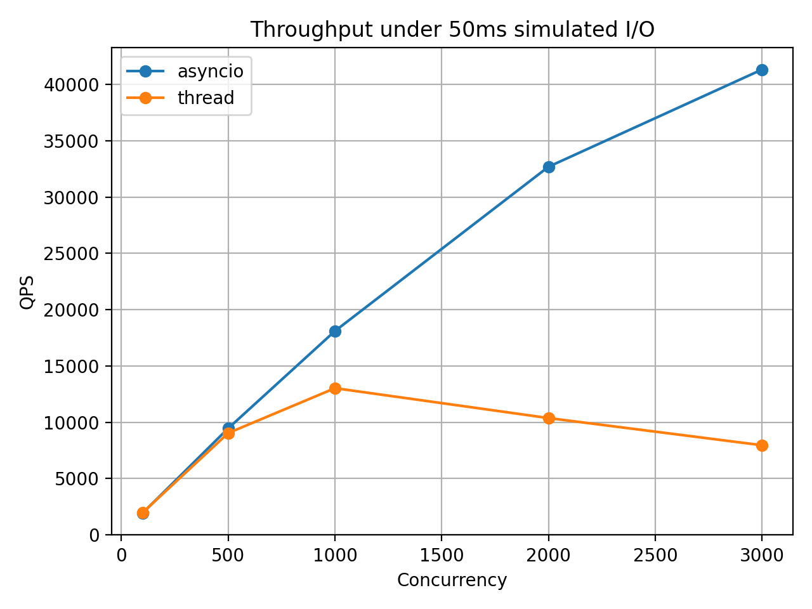
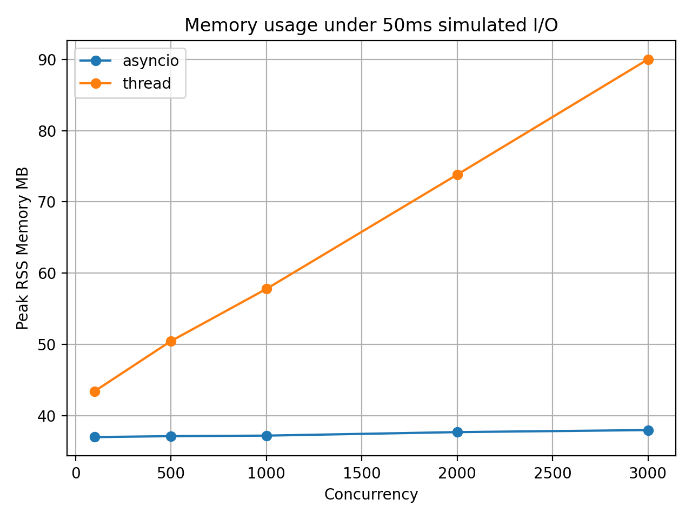
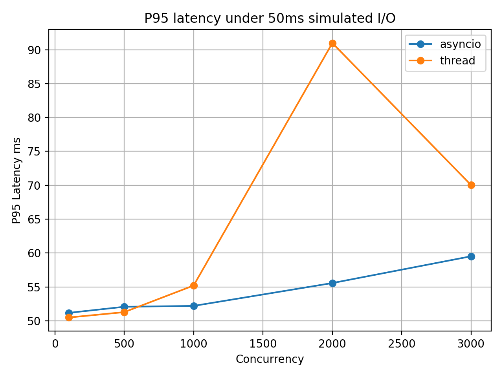
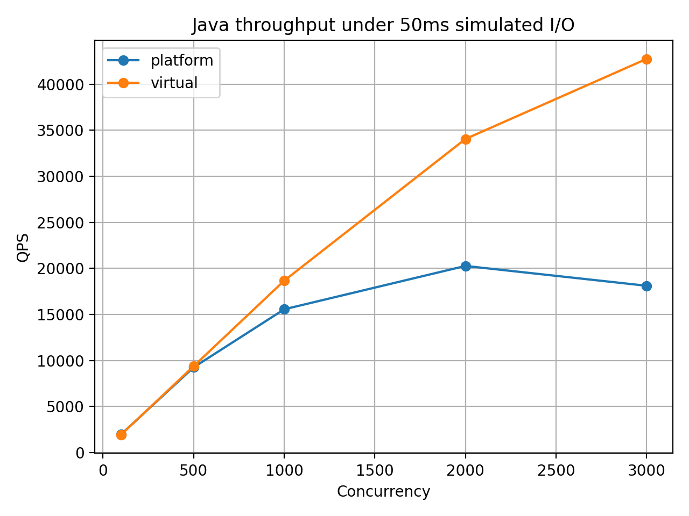
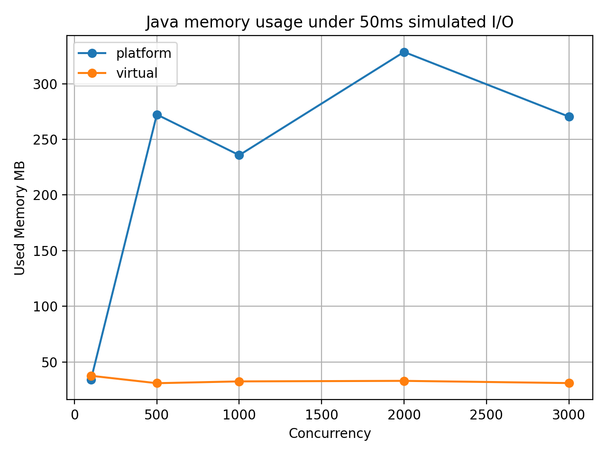
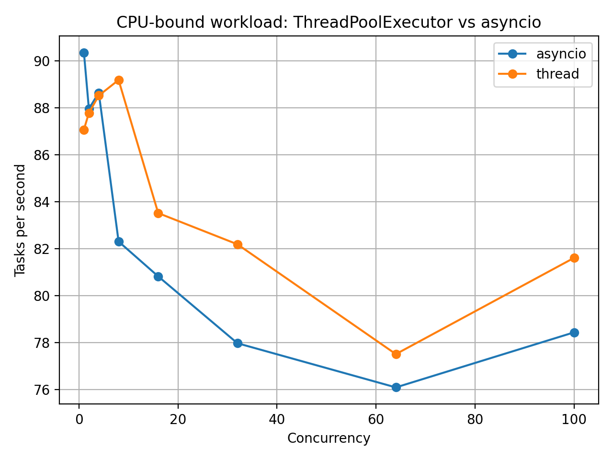
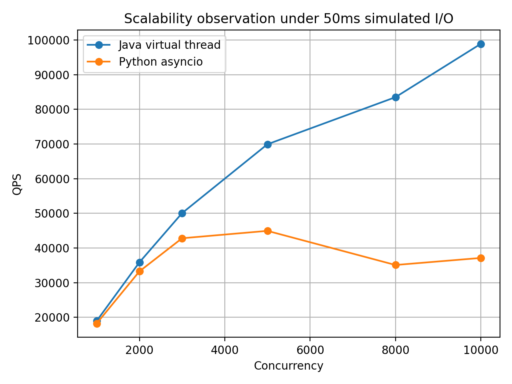
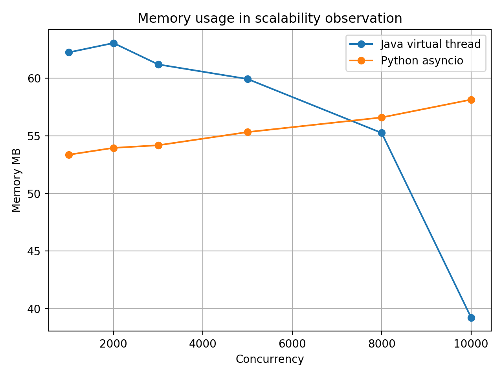

# NKU 协程并发性能实验

本仓库是南开大学《并行程序设计》课程中“协程技术调研”作业的实验部分。

本项目围绕协程、虚拟线程和传统线程模型在不同任务类型下的表现进行实验比较，重点分析高并发 I/O 密集型任务中轻量级并发模型的优势与适用边界。实验主要对比：

- Python `ThreadPoolExecutor`
- Python `asyncio`
- Java Platform Thread
- Java 21 Virtual Thread

本仓库的目标不是构建工业级 benchmark 框架，而是为课程调研报告和 PPT 提供可复现实验代码、CSV 数据和可视化图表。

---

## 1. 背景说明

随着云服务并发度不断提高，传统“一个请求对应一个操作系统线程”的模型在大量 I/O 等待型任务中容易暴露出资源开销问题，例如线程栈内存占用、线程调度开销和尾延迟抖动。

协程和虚拟线程等轻量级并发模型的核心价值并不是让单个任务执行得更快，而是让大量等待型任务能够以更低成本并发执行。

本项目围绕以下问题展开实验：

> 在高并发 I/O 密集型任务中，协程或虚拟线程是否比传统线程模型更适合？它们的适用边界又在哪里？

---

## 2. 仓库结构

```text
.
├── README.md
├── requirements.txt
├── .gitignore
├── src/
│   ├── python_io_bench.py
│   ├── python_cpu_bench.py
│   ├── plot_python_results.py
│   ├── plot_java_results.py
│   ├── plot_python_cpu_results.py
│   ├── plot_scale_results.py
│   └── JavaThreadBench.java
├── scripts/
│   ├── run_python_exp.sh
│   ├── run_java_exp.sh
│   ├── run_python_cpu_exp.sh
│   ├── run_python_asyncio_scale_exp.sh
│   ├── run_java_virtual_scale_exp.sh
│   └── collect_env.sh
├── results/
│   ├── python_results.csv
│   ├── java_results.csv
│   ├── python_cpu_results.csv
│   ├── python_asyncio_scale_results.csv
│   ├── java_virtual_scale_results.csv
│   └── scale_merged_results.csv
├── figures/
│   ├── python_qps_io_50ms.png
│   ├── python_memory_io_50ms.png
│   ├── python_p95_io_50ms.png
│   ├── java_qps_io_50ms.png
│   ├── java_memory_io_50ms.png
│   ├── python_cpu_qps.png
│   ├── scale_qps.png
│   └── scale_memory.png
└── docs/
    └── env.txt
```

其中：

| 路径 | 说明 |
|---|---|
| `src/` | 实验源代码和画图脚本 |
| `scripts/` | 一键运行脚本 |
| `results/` | 实验生成的 CSV 数据 |
| `figures/` | 实验结果图，用于报告和 PPT |
| `docs/` | 实验环境记录 |

---

## 3. 实验环境

实验在无 GPU 的轻薄本上完成。由于本实验主要关注 I/O 等待、任务调度和内存占用，因此不需要 GPU。

推荐环境：

```text
OS: WSL2 + Ubuntu 24.04
Python: Python 3.12.3
Java: JDK 21
```

安装 Python 依赖：

```bash
python3 -m venv venv
source venv/bin/activate
pip install -r requirements.txt
```

检查 Java 版本：

```bash
java -version
javac -version
```

Java 虚拟线程需要 JDK 21 或更高版本。

---

## 4. 实验一：Python I/O 密集型并发实验

本实验对比 Python `ThreadPoolExecutor` 与 `asyncio`。

每个任务被建模为：

```text
少量 CPU 计算 + 50ms 模拟 I/O 等待
```

其中：

- 线程版本使用 `time.sleep()` 模拟 I/O 等待；
- 协程版本使用 `await asyncio.sleep()` 模拟 I/O 等待。

主要参数：

```text
TOTAL = 10000
CONCURRENCY = 100, 500, 1000, 2000, 3000
I/O waiting = 50ms
```

运行实验：

```bash
bash scripts/run_python_exp.sh
```

生成图表：

```bash
python src/plot_python_results.py
```

主要结果：







实验观察：

- 低并发下，线程模型和 `asyncio` 差异不明显；
- 并发数提高后，`asyncio` 吞吐量更稳定；
- 线程模型内存占用随并发数明显增长；
- 高并发下线程模型更容易出现 P95 延迟抖动。

---

## 5. 实验二：Java 平台线程与虚拟线程实验

本实验对比 Java Platform Thread 与 Java 21 Virtual Thread。

每个任务执行：

```text
少量 CPU 计算 + Thread.sleep(50ms)
```

主要参数：

```text
TOTAL = 10000
CONCURRENCY = 100, 500, 1000, 2000, 3000
I/O waiting = 50ms
```

运行实验：

```bash
bash scripts/run_java_exp.sh
```

生成图表：

```bash
python src/plot_java_results.py
```

主要结果：





实验观察：

- Java Virtual Thread 在高并发下吞吐量继续增长；
- Platform Thread 在并发数较高时吞吐量出现下降；
- Platform Thread 内存占用显著高于 Virtual Thread；
- Virtual Thread 保留了同步阻塞式代码风格，同时降低了大量阻塞任务的线程资源压力。

---

## 6. 实验三：CPU 密集型反例实验

本实验去掉 I/O 等待，将每个任务改为纯 CPU 循环计算，用于说明协程并不是通用计算加速器。

运行实验：

```bash
bash scripts/run_python_cpu_exp.sh
```

生成图表：

```bash
python src/plot_python_cpu_results.py
```

主要结果：



实验观察：

- 在 CPU 密集型任务中，`asyncio` 没有表现出 I/O 场景中的明显优势；
- 纯 CPU 任务内部没有频繁 `await` 挂起点，事件循环无法有效切换任务；
- Python 线程池在纯 Python CPU 计算中也受 CPython GIL 影响，难以稳定获得多核加速；
- CPU 密集型任务更适合使用多进程、底层语言扩展、并行算法、SIMD 或 GPU 等方式优化。

---

## 7. 实验四：高并发上限观察

本实验只观察轻量级并发模型在更高并发下的扩展趋势：

- Python `asyncio`
- Java Virtual Thread

主要参数：

```text
CONCURRENCY = 1000, 2000, 3000, 5000, 8000, 10000
I/O waiting = 50ms
```

运行实验：

```bash
bash scripts/run_python_asyncio_scale_exp.sh
bash scripts/run_java_virtual_scale_exp.sh
```

生成图表：

```bash
python src/plot_scale_results.py
```

主要结果：





实验观察：

- 轻量级并发模型能够扩展到更高数量的等待型任务；
- Java Virtual Thread 在该模拟 I/O 场景下表现出较强扩展性；
- Python `asyncio` 在高并发下也能维持较高吞吐，但极高并发时存在一定波动；
- 内存数据需要谨慎解释，因为 Python 记录的是进程 RSS，而 Java 记录的是 JVM used memory，二者不能直接做绝对值比较。

---

## 8. 记录实验环境

运行：

```bash
bash scripts/collect_env.sh
```

环境信息会保存到：

```text
docs/env.txt
```

---

## 9. 一键复现实验流程

从仓库根目录执行：

```bash
# 创建虚拟环境并安装依赖
python3 -m venv venv
source venv/bin/activate
pip install -r requirements.txt

# Python I/O 实验
bash scripts/run_python_exp.sh
python src/plot_python_results.py

# Java I/O 实验
bash scripts/run_java_exp.sh
python src/plot_java_results.py

# CPU 密集型反例实验
bash scripts/run_python_cpu_exp.sh
python src/plot_python_cpu_results.py

# 高并发扩展实验
bash scripts/run_python_asyncio_scale_exp.sh
bash scripts/run_java_virtual_scale_exp.sh
python src/plot_scale_results.py

# 记录实验环境
bash scripts/collect_env.sh
```

---

## 10. 核心结论

- 协程和虚拟线程最适合 I/O 密集型高并发任务。
- 它们的优势不是让单个任务更快，而是让大量等待型任务的并发管理成本更低。
- 传统线程模型直观易用，但在高并发等待场景下容易带来内存和调度压力。
- Java Virtual Thread 在保持同步阻塞式编程风格的同时，降低了平台线程资源压力。
- 协程并不能解决 CPU 密集型计算瓶颈，CPU 密集型任务应考虑多进程、并行算法或底层优化。

---

## 11. 注意事项

本项目用于课程调研实验，不是工业级性能测试框架。实验结果可能受以下因素影响：

- CPU 型号
- 内存大小
- WSL 配置
- JVM 版本
- Python 版本
- 系统后台负载

如果需要更严格的实验结论，可以多次重复运行实验并取平均值。

---

## 12. 课程背景

本仓库属于南开大学《并行程序设计》课程中“协程技术调研”作业的实验部分，用于支撑调研报告和汇报 PPT 中的实验分析。